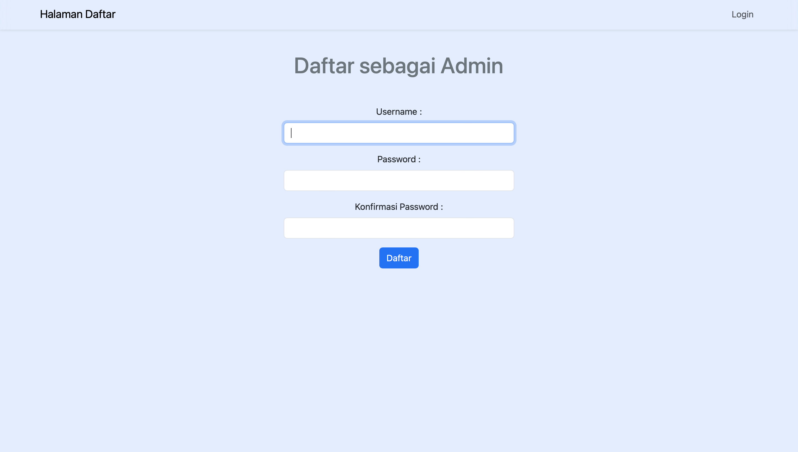
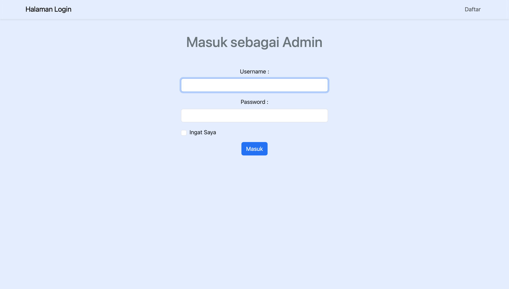

Website untuk mengelola data mahasiswa menggunakan Mysql Database, PHP dan Bootstrap 5 CSS Framework dengan fitur :

- Daftar sebagai pengelola data
- Login sebagai pengelola data
- Remember me (ingat saya) saat login
- CRUD(menambah, menghapus dan mengubah data mahasiswa) 
- Search data dalam daftar data mahasiswa

Link Hosting : http://muhammadjundullah.great-site.net

Username dan Password untuk masuk sebagai pengelola
Username : admin
Password : 123

Fitur :

- Daftar sebagai pengelola data.
  

- Login sebagai pengelola data
  
  
- Menampilkan daftar data mahasiswa.
  

- Menambahkan data mahasiswa termasuk upload gambar.
  

- Mengubah data mahasiswa.
  
