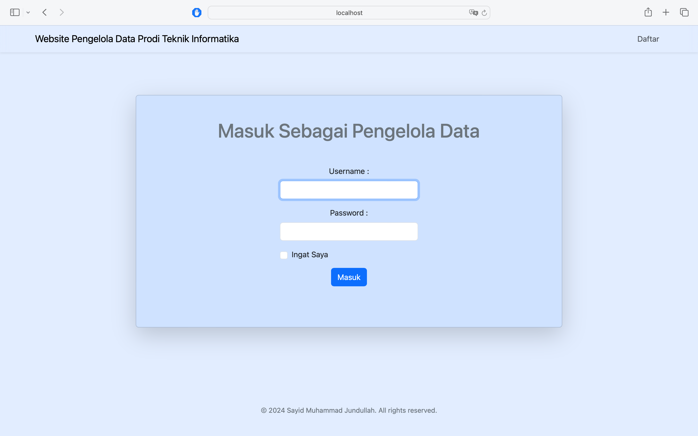

{\rtf1\ansi\ansicpg1252\cocoartf2709
\cocoatextscaling0\cocoaplatform0{\fonttbl\f0\fswiss\fcharset0 Helvetica;}
{\colortbl;\red255\green255\blue255;}
{\*\expandedcolortbl;;}
\paperw11900\paperh16840\margl1440\margr1440\vieww11520\viewh8400\viewkind0
\pard\tx720\tx1440\tx2160\tx2880\tx3600\tx4320\tx5040\tx5760\tx6480\tx7200\tx7920\tx8640\pardirnatural\partightenfactor0

\f0\fs24 \cf0 Website untuk mengelola data mahasiswa menggunakan Mysql Database, PHP dan Bootstrap 5 CSS Framework dengan fitur :\
\
- Daftar sebagai pengelola data\
- Login sebagai pengelola data\
- Remember me (ingat saya) saat login\
- CRUD(menambah, menghapus dan mengubah data mahasiswa) \
- Search data dalam daftar data mahasiswa\
\
Link Hosting : http://muhammadjundullah.great-site.net\
\
Username dan Password untuk masuk sebagai pengelola\
 Username : admin\
 Password : 123\
\
page :\
\
- Daftar Sebagai Pengelola Data.\
  \
\
- Login Sebagai Pengelola Data\
  \
  \
- Menampilkan Daftar Data Mahasiswa.\
  \
\
- Menampilkan daftar Dadwal Perkuliahan.\
  \
\
- Menampilkan daftar Kelas.\
  \
\
- Menampilkan daftar Mata Kuliah..\
  \
\
- Menampilkan daftar Dosen.\
  \
}