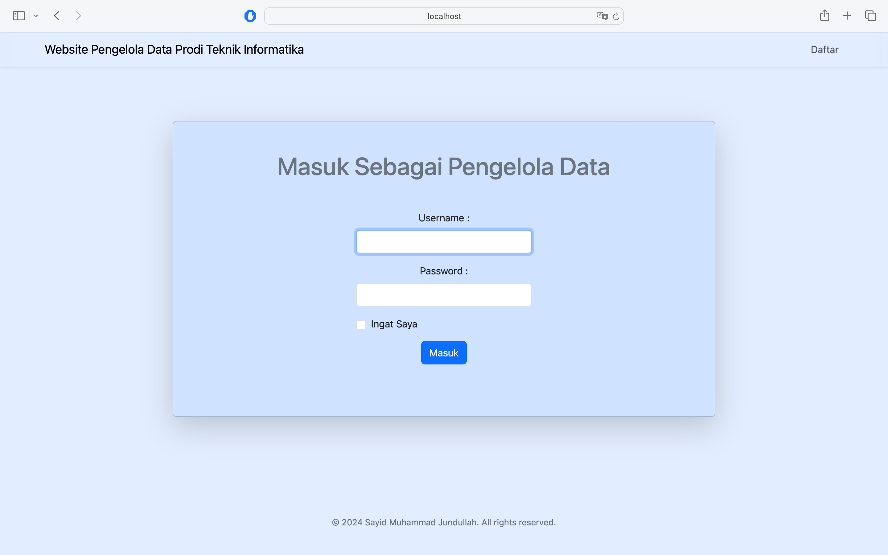

Website untuk mengelola data mahasiswa menggunakan Mysql Database, PHP dan Bootstrap 5 CSS Framework dengan fitur :

- Daftar sebagai pengelola data
- Login sebagai pengelola data
- Remember me (ingat saya) saat login
- CRUD(menambah, menghapus dan mengubah data mahasiswa) 
- Search data dalam daftar data mahasiswa

Link Hosting : http://muhammadjundullah.great-site.net

Username dan Password untuk masuk sebagai pengelola
 Username : admin
 Password : 123

page :

- Daftar Sebagai Pengelola Data.
  

- Login Sebagai Pengelola Data
  
  
- Menampilkan Daftar Data Mahasiswa.
  

- Menampilkan daftar Dadwal Perkuliahan.
  

- Menampilkan daftar Kelas.
  

pardtx720tx1440tx2160tx2880tx3600tx4320tx5040tx5760tx6480tx7200tx7920tx8640pardirnaturalpartightenfactor0
cf0 - Menampilkan daftar Mata Kuliah..
  

- Menampilkan daftar Dosen.
  
}
